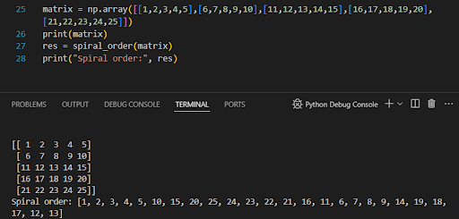

# Part 0: Warmup Time !!

Hello, we hope you had a good time watching the tutorials and have learned a lot from them. Let’s try out the following questions\!.

**CAUTION:**
**AVOID USING LOOPS AS MUCH AS YOU CAN, TRY USING INBUILT FUNCTIONS AS MUCH AS POSSIBLE.**

1. Create a .py file to print a 2-dimensional NumPy array of shape (5, 5\) filled with random\* integers between 1 and 100\. Also perform the following tasks in it:  
   1. Extract and print the middle element of the array using NumPy indexing.  
   2. Calculate and print the mean of each row of the array.  
   3. Create a new array that contains only the elements from the original array that are greater than the overall mean of the array.  
   4. Write a Python function numpy\_spiral\_order(matrix) that takes a NumPy matrix and returns a list containing the elements visited in a spiral order.

      Example:

**Hints:**

* Use np.random.randint() to create the initial array arr.  
* Use NumPy functions like np.mean() and boolean indexing to perform calculations and extract elements.

**Now let’s try to apply Python libraries on a dataset of Video Game Sales\!**

2.  Create a Jupyter Notebook or a Google Colab Notebook, download the dataset in the drive link, and solve the following questions using the required Python libraries:  
   1. Add a column of ‘global\_sales’ showing the total sales of all the different regions to the data frame and sort (highest first) and print the DataFrame according to it.  
   2. Display a plot of the total number of copies sold of each genre globally.  
   3. Filter out only the games containing ‘Grand Theft Auto’ in their name and display the following as a DataFrame:  
      1. their name  
      2. the platform they were released on  
      3. the year they were released in  
      4. the sum of sales in only Europe and Japan  
   4. Display a pie chart of the total sales of all Grand Theft Auto games combined in North America, Europe, Japan, and other sales.
